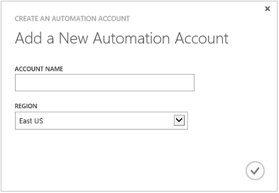
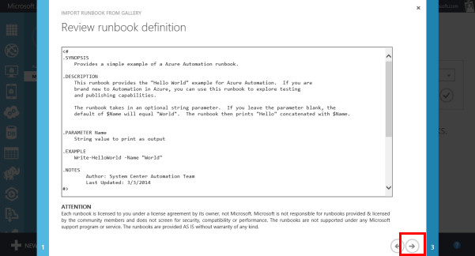
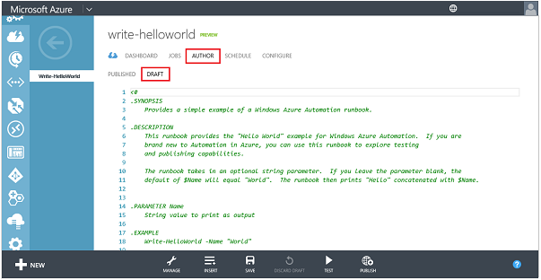
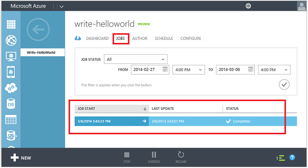

<properties
	pageTitle="Get Started with Azure Automation | Microsoft Azure"
	description="Learn how to import and run an automation job in Azure."
	services="automation"
	documentationCenter=""
	authors="bwren"
	manager="stevenka"
	editor=""/>

<tags
	ms.service="automation"
	ms.workload="tbd"
	ms.tgt_pltfrm="na"
	ms.devlang="na"
	ms.topic="hero-article" 
	ms.date="12/08/2015"
	ms.author="bwren"/>

# Get started with Azure Automation

## What is Azure Automation?

Microsoft Azure Automation provides a way for users to automate the manual, long-running, error-prone, and frequently repeated tasks that are commonly performed in a cloud environment. You can create, monitor, manage, and deploy resources in your Azure environment using runbooks, which are based on Windows PowerShell workflows. In this article, you will go through a tutorial for running a simple example runbook. You will then find resources for exploring more advanced capabilities of the service.

## Tutorial
This tutorial walks you through creating an automation account, importing a sample "Hello World" runbook into Azure Automation, executing that runbook, and then viewing its output.

To complete this tutorial, you will need an Azure subscription. If you don't have one yet, you can [activate your MSDN subscriber benefits](../pricing/member-offers/msdn-benefits-details/) or [sign up for a free trial](../pricing/free-trial.md)</a>.

[AZURE.INCLUDE [automation-note-authentication](../../includes/automation-note-authentication.md)]

## Video walkthrough

Here's a walkthrough of this tutorial.

[AZURE.VIDEO get-started-with-azure-automation]

## Create an automation account

An automation account is a container for your Azure Automation resources. It provides a way to separate your environments or further organize your workflows. For more information, see [Automation accounts](http://aka.ms/runbookauthor/azure/automationaccounts) in the Automation Library.  If you've already created an automation account, you can skip this step.

1.	Log in to the [Azure portal](http://manage.windowsazure.com).

2.	In the Azure portal, click **Create an Automation Account**.  

	

3.	On the **Add a New Automation Account** page, enter a name and pick a region for the account. The region specifies where the Automation resources in the account will be stored. This will not affect the functionality of your account, but your runbooks may execute faster if your account region is near where your other Azure resources are stored. When you're ready, click the check mark.

	

## Import runbook from Runbook Gallery

The [Runbook Gallery](http://aka.ms/runbookgallery) includes sample runbooks that you can import directly into an Azure Automation account, allowing you to leverage the work of other Azure Automation and PowerShell users. In this step, you will use the gallery to import the "Hello World" sample runbook.

4.	On the **Automation** page, click the new account you just created.

	

5.	Click **RUNBOOKS**.

	

6.	Click **New** > **Runbook** > **From Gallery**.

	

7.  Select the **Tutorial** category, and then **Hello World for Azure Automation**. Click the right arrow button.

	

8.  Review the contents of the runbook, and then click the right arrow button.

	

8.	Review the runbook details, and then click the check mark button.

	

## Publish runbook

The runbook is first imported in Draft mode. This means you can continue to do work on it before authorizing it as a new version that can be run. Since this sample runbook requires no additional configuration, you will now publish it as-is.  For more information, see [Publishing a Runbook](http://aka.ms/runbookauthor/azure/publishrunbook).

9.	When the runbook has finished importing, click **Write-HelloWorld**.

	

9.	Click **AUTHOR**, and then click **DRAFT**.  

	You can modify the contents of a runbook in Draft mode. For this runbook, you don’t need to make any modifications.

	  

10.	Click **PUBLISH** to promote the runbook, marking it ready for production use.

	

11.	When you are prompted for confirmation, click **Yes**.

	

## Start runbook

With the runbook imported and published, you can now run it and then inspect the output.  For more information, see [Starting a Runbook](http://aka.ms/runbookauthor/azure/startrunbook) and [Runbook Output and Messages](http://aka.ms/runbookauthor/azure/runbookoutput).

12.	With the **Write-HelloWorld** runbook open, click **START**.

	

13.	On the **Specify the runbook parameter values** page, type a **Name** that will be used as an input parameter for the Write-HelloWorld.ps1 script, and then click the check mark.

	

14.	Click **JOBS** to check the status of the runbook job you just started, and then click the timestamp in the **JOB START** column to view the job summary.

	

15.	On the **SUMMARY** page you can see the summary, input parameters, and output of the job.

	

Congratulations! You have finished the tutorial.

## Next steps
1. The simple runbook in this tutorial *does not manage Azure services*. Most runbooks will use the [Azure cmdlets](http://msdn.microsoft.com/library/jj156055.aspx) to do so, which require authentication to your Azure subscription. Follow the instructions at [Configuring Azure for Management by Runbooks](http://aka.ms/azureautomationauthentication) to configure your Azure subscription to work with these cmdlets.  
2. Refer to the [Resources](#resources) listed below for more information about Azure Automation's capabilities.
3. Subscribe to the [Azure Automation Blog](http://azure.microsoft.com/blog/tag/azure-automation) to stay up-to-date with the latest from the Azure Automation team.

## Resources

A variety of other resources are available for you to learn more about Azure Automation and creating your own runbooks.

- [Azure Automation Library](http://go.microsoft.com/fwlink/p/?LinkId=392860) provides complete documentation on the configuration and administration of Azure Automation and for authoring your own runbooks.
- [Azure PowerShell cmdlets](http://msdn.microsoft.com/library/jj156055.aspx) provides information for automation Azure operations using Windows PowerShell.  Runbooks use these cmdlets to work with Azure resources.
- [Azure Automation Blog](http://azure.microsoft.com/blog/tag/azure-automation) provides the latest information on Azure Automation from Microsoft.
- [Automation Forum](http://go.microsoft.com/fwlink/p/?LinkId=390561) allows you to post questions about Azure Automation to be addressed by Microsoft and the Automation community.

## Samples and utility runbooks

Microsoft and the Azure Automation community provide sample runbooks, which can help you get started creating your own solutions, and utility runbooks, which you can use as building blocks for larger automation tasks. You can either download these runbooks from the [Script Center](http://azure.microsoft.com/documentation/scripts/) or import them directly into Azure Automation using the [Runbook Gallery](http://aka.ms/runbookgallery).

## Feedback

**Give us feedback!**  If you are looking for an Azure Automation runbook solution or an integration module, post a Script Request on Script Center. If you have feedback or feature requests for Azure Automation, post them on [User Voice](http://feedback.windowsazure.com/forums/34192--general-feedback). Thanks!
