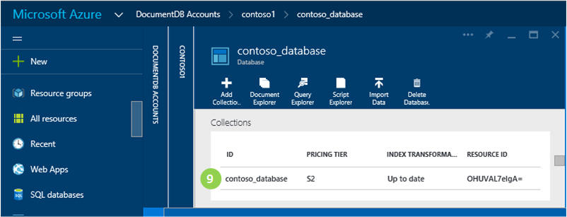

<properties 
	pageTitle="Create a DocumentDB database collection | Microsoft Azure" 
	description="Learn how to create collections using the online service portal for Azure DocumentDB, a managed NoSQL document database for JSON. Get a free trial today." 
	services="documentdb" 
	authors="mimig1" 
	manager="jhubbard" 
	editor="monicar" 
	documentationCenter=""/>

<tags 
	ms.service="documentdb" 
	ms.workload="data-services" 
	ms.tgt_pltfrm="na" 
	ms.devlang="na" 
	ms.topic="article" 
	ms.date="09/28/2015" 
	ms.author="mimig"/>

# Create a DocumentDB collection

To use Microsoft Azure DocumentDB, you must have a [DocumentDB account](documentdb-create-account.md), a [database](documentdb-create-database.md), a collection, and documents. This topic describes how to create a DocumentDB collection in the Azure Portal. 

1.  In the [Azure Portal](https://portal.azure.com/), in the Jumpbar, click **DocumentDB Accounts**. 

2.  In the **DocumentDB Accounts** blade, select the account in which to add a collection. If you don't have any accounts listed, you'll need to [create a DocumentDB account](documentdb-create-account.md).

3. In the **DocumentDB account** blade for the selected account, scroll down to the **Databases** lens, and then select the database in which to add a collection.
    
4. In the **Database** blade, click **Add collections**.

	

5. In the **Add Collection** blade, enter the ID for your new collection. When the name is validated, a green check mark appears in the ID box.

6. Select a pricing tier for the new collection. Each collection you create is a billable entity. For more information about the performance levels available, see [Performance levels in DocumentDB](documentdb-performance-levels.md).

7. Select one of the following **Indexing Policies**. 

	- **Default**. This policy is best when you’re performing equality queries against strings and using ORDER BY, range, and equality queries for numbers.  This policy has a lower index storage overhead than **Range**.
	- **Hash**. This policy is best when you’re performing equality queries for both numbers and strings.  This policy has the lowest index storage overhead.
	- **Range**. This policy is best when you’re using ORDER BY, range and equality queries on both numbers and strings.  This policy has a higher index storage overhead than **Default** or **Hash**.

	For more information about the indexing policies, see [DocumentDB indexing policies](documentdb-indexing-policies.md).

8. Click **OK** at the bottom of the screen to create the new collection. 

9. The new collection now appears in the **Collections** lens on the **Database** blade.
 
	

## Other ways to create a DocumentDB collection

Collections do not have to be created using the Portal, you can also create them using the [DocumentDB SDKs](https://msdn.microsoft.com/library/azure/dn781482.aspx). For a C# code sample showing how to create a collection using the DocumentDB .NET SDK, see the [Program.cs](https://github.com/Azure/azure-documentdb-net/blob/master/samples/code-samples/CollectionManagement/Program.cs) file in the CollectionManagement project, available in the [azure-documentdb-net](https://github.com/Azure/azure-documentdb-net) repository on [GitHub.com](https://github.com).

## Next steps

Now that you have a collection, the next step is to add documents or import documents into the collection. When it comes to adding documents to a collection, you have a few choices:

- You can [add documents](../documentdb-view-json-document-explorer.md) by using the Document Explorer in the Portal.
- You can [import documents and data](documentdb-import-data.md) by using the DocumentDB Data Migration Tool, which enables you to import JSON and CSV files, as well as data from SQL Server, MongoDB, Azure Table storage, and other DocumentDB collections. 
- Or you can add documents by using one of the [DocumentDB SDKs](https://msdn.microsoft.com/library/azure/dn781482.aspx). DocumentDB has .NET, Java, Python, Node.js, and JavaScript API SDKs. The [Program.cs](https://github.com/Azure/azure-documentdb-net/blob/master/samples/code-samples/DocumentManagement/Program.cs) file in the DocumentManagement project, available in the [azure-documentdb-net](https://github.com/Azure/azure-documentdb-net) repository on [GitHub.com](https://github.com), demonstrates CRUD operations on documents by using the DocumentDB .NET SDK.

After you have documents in a collection, you can use [DocumentDB SQL](documentdb-sql-query.md) to [execute queries](documentdb-sql-query.md#executing-queries) against your documents by using the [Query Explorer](documentdb-query-collections-query-explorer.md) in the Portal, the [REST API](https://msdn.microsoft.com/library/azure/dn781481.aspx), or one of the [SDKs](https://msdn.microsoft.com/library/azure/dn781482.aspx). 
