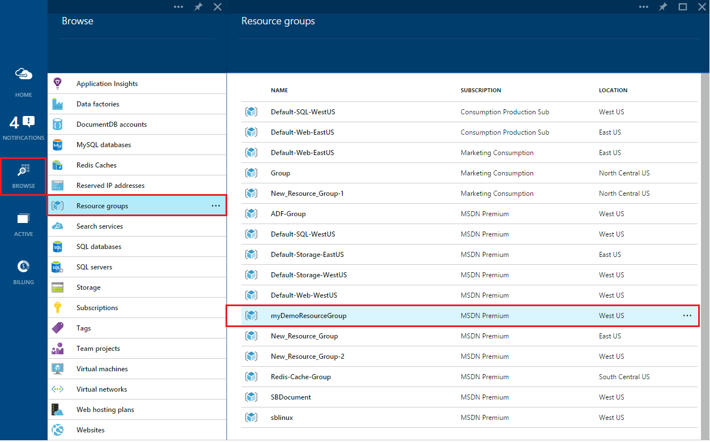
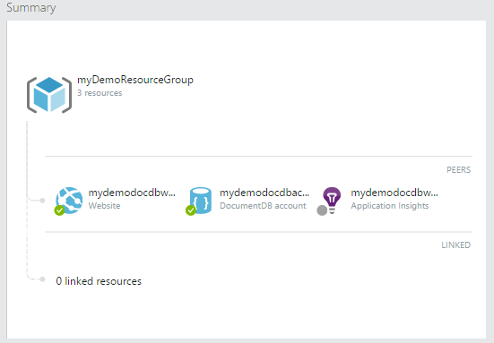
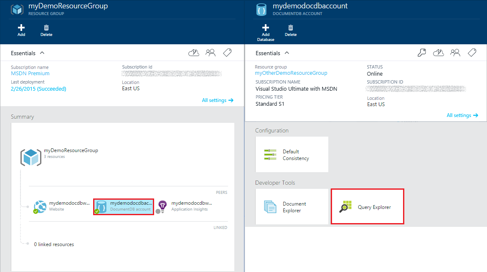
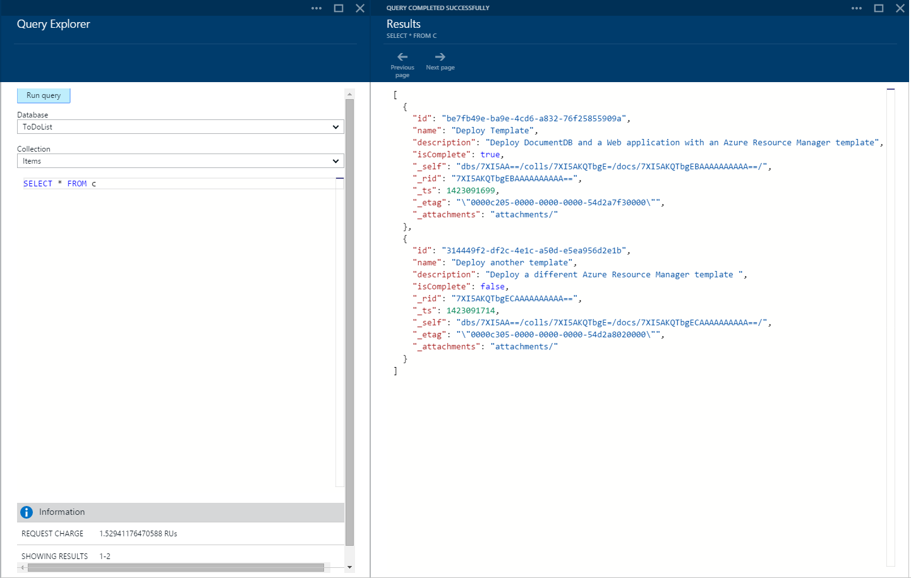
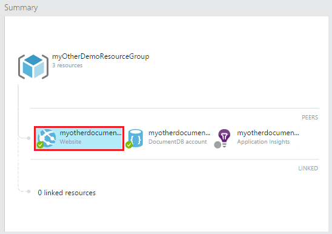
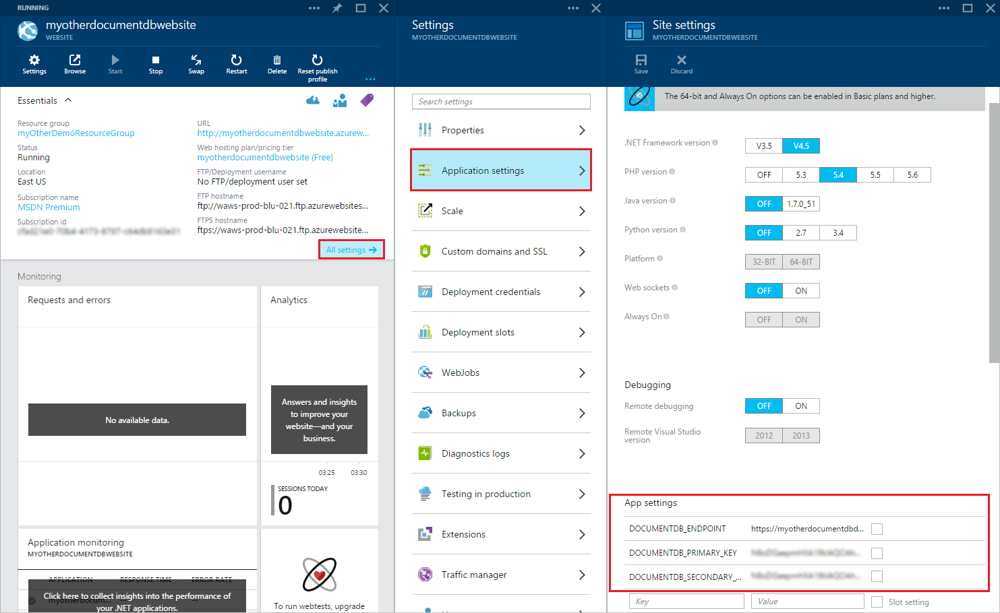

<properties 
	pageTitle="Deploy DocumentDB and Azure App Service Web Apps using an Azure Resource Manager Template | Microsoft Azure" 
	description="Learn how to deploy a DocumentDB account, Azure App Service Web Apps, and a sample web application using an Azure Resource Manager template." 
	services="documentdb, app-service\web" 
	authors="ryancrawcour" 
	manager="jhubbard" 
	editor="monicar" 
	documentationCenter=""/>

<tags 
	ms.service="documentdb" 
	ms.workload="data-services" 
	ms.tgt_pltfrm="na" 
	ms.devlang="na" 
	ms.topic="article" 
	ms.date="10/16/2015" 
	ms.author="ryancraw"/>

# Deploy DocumentDB and Azure App Service Web Apps using an Azure Resource Manager Template #

This tutorial shows you how to use an Azure Resource Manager template to deploy and integrate [Microsoft Azure DocumentDB](http://azure.microsoft.com/services/documentdb/), an [Azure App Service](http://go.microsoft.com/fwlink/?LinkId=529714) web app, and a sample web application.

After completing this tutorial, you'll be able to answer the following questions:  

-	How can I use an Azure Resource Manager template to deploy and integrate a DocumentDB account and a web app in Azure App Service?
-	How can I use an Azure Resource Manager template to deploy and integrate a DocumentDB account, a web app in App Service Web Apps, and a Webdeploy application?

## Prerequisites ##
> [AZURE.TIP] While this tutorial does not assume prior experience with Azure Resource Manager templates, JSON, or Azure PowerShell, should you wish to modify the referenced templates or deployment options, then knowledge of each of these areas will be required.

Before following the instructions in this tutorial, ensure that you have the following:

- An Azure subscription. Azure is a subscription-based platform.  For more information about obtaining a subscription, see [Purchase Options](http://azure.microsoft.com/pricing/purchase-options/), [Member Offers](http://azure.microsoft.com/pricing/member-offers/), or [Free Trial](http://azure.microsoft.com/pricing/free-trial/).
- An Azure Storage Account. For instructions, see [About Azure Storage Accounts](../storage-whatis-account.md).
- A workstation with Azure PowerShell 0.9.8. For instructions, see [Install and configure Azure PowerShell](../install-configure-powershell.md). This tutorial has not yet been updated for Azure PowerShell 1.0 Preview. 

##Step 1: Download and extract the sample files ##
Let's start by downloading the sample files we will use in this tutorial.

1. Download the [Create a DocumentDB account, Web Apps, and deploy a demo application sample](https://portalcontent.blob.core.windows.net/samples/CreateDocDBWebsiteTodo.zip) to a local folder (e.g. C:\DocumentDBTemplates) and extract the files.  This sample will deploy a DocumentDB account, an App Service web app, and a web application.  It will also automatically configure the web application to connect to the DocumentDB account.

2. Download the [Create a DocumentDB account and Web Apps sample](https://portalcontent.blob.core.windows.net/samples/CreateDocDBWebSite.zip) to a local folder (e.g. C:\DocumentDBTemplates) and extract the files.  This sample will deploy a DocumentDB account, an App Service web app, and will modify the web app's configuration to easily surface DocumentDB connection information, but does not include a web application.  

> [AZURE.TIP] Note that depending on the security settings of your computer, you may need to unblock the extracted files by right-clicking, clicking **Properties**, and clicking **Unblock**.

##Step 2: Deploy the Document account, App Service web app and demo application sample ##

Now let's deploy our first template.

> [AZURE.TIP] The template does not validate that the web app name and DocumentDB account name entered below are a) valid and b) available.  It is highly recommended that you verify the availability of the names you plan to supply prior to running the PowerShell deployment script.

1. Open Microsoft Azure PowerShell and navigate to the folder in which you downloaded and extracted the [Create a DocumentDB account, App Service web app, and deploy a demo application sample](https://portalcontent.blob.core.windows.net/samples/CreateDocDBWebsiteTodo.zip) (e.g. C:\DocumentDBTemplates\CreateDocDBWebsiteTodo).

2. We're going to run the CreateDocDBWebsiteTodo.ps1 PowerShell script.  The script takes the following mandatory parameters:
	- WebsiteName: Specifies the App Service web app name and is used to construct the URL that you will use to access the web app (e.g. if you specify "mydemodocdbwebapp", then the URL by which you will access the web app will be mydemodocdbwebapp.azurewebsites.net).

	- ResourceGroupName: Specifies the name of the Azure Resource Group to deploy. If the specified Resource Group doesn't exist, it will be created.

	- docDBAccountName: Specifies the name of the DocumentDB account to create.

	- location: Specifies the Azure location in which to create the DocumentDB and web app resources.  Valid values are East Asia, Southeast Asia, East US, West US, North Europe, West Europe (note that the location value provided is case sensitive).

3. Here is an example command to run the script:

    	PS C:\DocumentDBTemplates\CreateDocDBWebAppTodo> .\CreateDocDBWebsiteTodo.ps1 -WebSiteName "mydemodocdbwebapp" -ResourceGroupName "myDemoResourceGroup" -docDBAccountName "mydemodocdbaccount" -location "West US"

	> [AZURE.TIP] Note that you will be prompted to enter your Azure account username and password as part of running the script.  The full deployment will take between 10 and 15 minutes to complete.  	

4. And here is an example of the resulting output: 

		VERBOSE: 1:06:00 PM - Created resource group 'myDemoResourceGroup' in location westus'
		VERBOSE: 1:06:01 PM - Template is valid.
		VERBOSE: 1:06:01 PM - Create template deployment 'Microsoft.DocumentDBWebSiteTodo'.
		VERBOSE: 1:06:08 PM - Resource Microsoft.DocumentDb/databaseAccounts 'mydemodocdbaccount' provisioning status is running
		VERBOSE: 1:06:10 PM - Resource Microsoft.Web/serverFarms 'mydemodocdbwebapp' provisioning status is succeeded
		VERBOSE: 1:06:14 PM - Resource microsoft.insights/alertrules 'CPUHigh mydemodocdbwebapp' provisioning status is succeeded
		VERBOSE: 1:06:16 PM - Resource microsoft.insights/autoscalesettings 'mydemodocdbwebapp-myDemoResourceGroup' provisioning status is succeeded
		VERBOSE: 1:06:16 PM - Resource microsoft.insights/alertrules 'LongHttpQueue mydemodocdbwebapp' provisioning status is succeeded
		VERBOSE: 1:06:21 PM - Resource Microsoft.Web/Sites 'mydemodocdbwebapp' provisioning status is succeeded
		VERBOSE: 1:06:23 PM - Resource microsoft.insights/alertrules 'ForbiddenRequests mydemodocdbwebapp' provisioning status is succeeded
		VERBOSE: 1:06:25 PM - Resource microsoft.insights/alertrules 'ServerErrors mydemodocdbwebapp' provisioning status is succeeded
		VERBOSE: 1:06:25 PM - Resource microsoft.insights/components 'mydemodocdbwebapp' provisioning status is succeeded
		VERBOSE: 1:16:22 PM - Resource Microsoft.DocumentDb/databaseAccounts 'mydemodocdbaccount' provisioning status is succeeded
		VERBOSE: 1:16:22 PM - Resource Microsoft.DocumentDb/databaseAccounts 'mydemodocdbaccount' provisioning status is succeeded
		VERBOSE: 1:16:24 PM - Resource Microsoft.Web/Sites/config 'mydemodocdbwebapp/web' provisioning status is succeeded
		VERBOSE: 1:16:27 PM - Resource Microsoft.Web/Sites/Extensions 'mydemodocdbwebapp/MSDeploy' provisioning status is running
		VERBOSE: 1:16:35 PM - Resource Microsoft.Web/Sites/Extensions 'mydemodocdbwebapp/MSDeploy' provisioning status is succeeded

		ResourceGroupName : myDemoResourceGroup
		Location          : westus
		Resources         : {mydemodocdbaccount, CPUHigh mydemodocdbwebapp, ForbiddenRequests mydemodocdbwebapp, LongHttpQueue mydemodocdbwebapp...}
		ResourcesTable    :
                    Name                                    Type                                   Location
                    ======================================  =====================================  =========
                    mydemodocdbaccount                      Microsoft.DocumentDb/databaseAccounts  westus
                    CPUHigh mydemodocdbwebapp              microsoft.insights/alertrules          eastus
                    ForbiddenRequests mydemodocdbwebapp    microsoft.insights/alertrules          eastus
                    LongHttpQueue mydemodocdbwebapp        microsoft.insights/alertrules          eastus
                    ServerErrors mydemodocdbwebapp         microsoft.insights/alertrules          eastus
                    mydemodocdbwebapp-myDemoResourceGroup  microsoft.insights/autoscalesettings   eastus
                    mydemodocdbwebapp                      microsoft.insights/components          centralus
                    mydemodocdbwebapp                      Microsoft.Web/serverFarms              westus
                    mydemodocdbwebapp                      Microsoft.Web/sites                    westus

		ProvisioningState : Succeeded

5. Before we look at our sample application, let's understand what the template deployment accomplished:

	- An App Service web app was created.

	- A DocumentDB account was created.

	- A Web Deploy package was deployed to the App Service web app

	- The web app configuration was modified such that the DocumentDB endpoint and primary master key were surfaced as application settings.

	- A series of default monitoring rules were created.

	
6. In order to use the application, simply navigate to the web app URL (in the example above, the URL would be http://mydemodocdbwebapp.azurewebsites.net).  You'll see the following web application:

	

7. Go ahead and create a couple of tasks and then let's open the [Microsoft Azure Portal](https://portal.azure.com).

8. Choose to browse Resource Groups and select the Resource Group we created during the deployment (in the sample above, myDemoResourceGroup).

	
9.  Notice how the resource map in the Summary lens shows all of our related resources (DocumentDB account, App Service web app, Monitoring).

	
10.  Click your DocumentDB account, and launch Query Explorer (near the bottom of the account blade).

	

11. Run the default query, "SELECT * FROM c" and inspect the results.  Notice that the query has retrieved the JSON representation of the todo items you created in step 7 above.  Feel free to experiment with queries; for example, try running SELECT * FROM c WHERE c.isComplete = true to return all todo items which have been marked as complete.

	
12. Feel free to explore the DocumentDB portal experience or modify the sample Todo application.  When you're ready, let's deploy another template.
	
 
## Step 3: Deploy the Document account and web app sample ##

Now let's deploy our second template.

> [AZURE.TIP] The template does not validate that the web app name and DocumentDB account name entered below are a) valid and b) available.  It is highly recommended that you verify the availability of the names you plan to supply prior to running the PowerShell deployment script.

1. Open Microsoft Azure PowerShell and navigate to the folder in which you downloaded and extracted the [Create a DocumentDB account and web app sample](https://portalcontent.blob.core.windows.net/samples/CreateDocDBWebSite.zip) (e.g. C:\DocumentDBTemplates\CreateDocDBWebsite).

2. We're going to run the CreateDocDBWebsite.ps1 PowerShell script.  The script takes the same parameters as the first template we deployed, namely:
	- WebsiteName: Specifies the App Service web app name and is used to construct the URL that you will use to access the web app (e.g. if you specify "myotherdocumentdbwebapp", then the URL by which you will access the web app will be myotherdocumentdbwebapp.azurewebsites.net).

	- ResourceGroupName: Specifies the name of the Azure Resource Group to deploy.  If the specified Resource Group doesn't exist, it will be created.

	- docDBAccountName: Specifies the name of the DocumentDB account to create.

	- 	location: Specifies the Azure location in which to create the DocumentDB and web app resources.  Valid values are East Asia, Southeast Asia, East US, West US, North Europe, West Europe (note that the location value provided is case sensitive).

3. Here is an example command to run the script:

    	PS C:\DocumentDBTemplates\CreateDocDBWebSite> .\CreateDocDBWebSite.ps1 -WebSiteName "myotherdocumentdbwebapp" -ResourceGroupName "myOtherDemoResourceGroup" -docDBAccountName "myotherdocumentdbdemoaccount" -location "East US"

	> [AZURE.TIP] Note that you will be prompted to enter your Azure account username and password as part of running the script.  The full deployment will take between 10 and 15 minutes to complete.  	

4. The deployment output will be very similar to the first template example. 
5. Before we open the Azure Portal, let's understand what this template deployment accomplished:

	- An App Service web app was created.

	- A DocumentDB account was created.

	- 	The web app configuration was modified such that the Azure DocumentDB endpoint, primary master key, and secondary master key were surfaced as application settings.

	- 	A series of default monitoring rules were created.

6. Let's open the [Azure Portal](https://portal.azure.com), choose to browse Resource Groups and select the Resource Group we created during the deployment (in the sample above, myOtherDemoResourceGroup).
7. In the Summary lens, click the web app which was just deployed.

	
8. On the web app's blade, click **All settings**, then **Application Settings** and note how there are application settings present for the DocumentDB endpoint and each of the DocumentDB master keys.

	
9. Feel free to continue exploring the Azure Portal, or follow one of our DocumentDB [samples](http://go.microsoft.com/fwlink/?LinkID=402386) to create your own DocumentDB application.

	
	

## Next steps

Congratulations! You've deployed DocumentDB, App Service web app and a sample web application using Azure Resource Manager templates.

- To learn more about DocumentDB, click [here](http://azure.com/docdb).
- To learn more about Azure App Service Web apps, click [here](http://go.microsoft.com/fwlink/?LinkId=325362).
- To learn more about Azure Resource Manager templates, click [here](https://msdn.microsoft.com/library/azure/dn790549.aspx).

## What's changed
* For a guide to the change from Websites to App Service see: [Azure App Service and Its Impact on Existing Azure Services](http://go.microsoft.com/fwlink/?LinkId=529714)
* For a guide to the change of the old portal to the new portal see: [Reference for navigating the Azure Classic Portal](http://go.microsoft.com/fwlink/?LinkId=529715)

>[AZURE.NOTE] If you want to get started with Azure App Service before signing up for an Azure account, go to [Try App Service](http://go.microsoft.com/fwlink/?LinkId=523751), where you can immediately create a short-lived starter web app in App Service. No credit cards required; no commitments.
 
